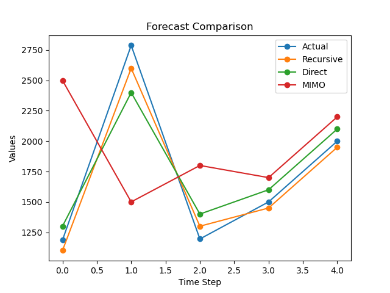

# 📊 Time Series Forecasting using Multi-Step Strategies

## 📌 Overview
This project focuses on forecasting future values of time series data using multiple multi-step forecasting strategies.  
The goal is to compare different approaches and analyze their performance in predicting future time steps.

---

## 🎯 Problem Statement
In real-world scenarios such as demand forecasting, stock prediction, and business analytics, predicting multiple future values is essential.  
This project evaluates different forecasting strategies to understand which performs best under given conditions.

---

## 🚀 Methods Implemented

### 1. Recursive Strategy
- Uses previous predictions as input for future steps  
- Simple and efficient  
- Can accumulate error over longer horizons  

### 2. Direct Strategy
- Builds separate models for each future time step  
- Reduces error propagation  
- Computationally expensive  

### 3. MIMO (Multi-Input Multi-Output using KNN)
- Predicts multiple future values in a single step  
- Captures dependencies between outputs  
- Performance depends on model and data quality  

### 4. Hybrid Strategy
- Combines multiple forecasting approaches  
- Aims to leverage strengths of different models  
- Helps balance accuracy and stability  

---

## 📊 Evaluation Metric
- **RMSE (Root Mean Square Error)**  
- Used to measure prediction accuracy  
- Lower RMSE indicates better performance  

---

## 📈 Results & Insights
- Recursive strategy achieved the **lowest RMSE** in this experiment  
- Direct strategy provided stable predictions but with slightly higher error  
- MIMO approach performed weaker, likely due to dataset size and model limitations  
- Hybrid strategy showed balanced performance but did not outperform Recursive  

👉 **Conclusion:**  
Recursive strategy performed best for this dataset.  
However, performance may vary depending on dataset characteristics, model choice, and forecasting horizon.

---

## 📊 Visualization

### Actual vs Predicted Values (Comparison of Recursive, Direct, MIMO, and Hybrid)

---

## 🧠 Key Learnings
- Multi-step forecasting strategies behave differently in real-world scenarios  
- Recursive models can perform well despite theoretical limitations  
- Model performance depends heavily on data and algorithm choice  
- Hybrid approaches can improve stability but require proper tuning  

---

## 🛠️ Tech Stack
- Python  
- K-Nearest Neighbors (KNN)  
- Basic data structures and logic implementation  

---

## ▶️ How to Run
1. Clone the repository  
2. Open the notebook or Python file  
3. Run all cells to generate predictions and results  

---

## 🔗 Future Improvements
- Add advanced models like ARIMA and LSTM  
- Perform hyperparameter tuning  
- Improve hybrid model performance  
- Add more visualizations for deeper analysis  

---

## 💡 Project Highlights
- Implemented multiple forecasting strategies from scratch  
- Compared models using RMSE  
- Built a hybrid approach for improved prediction  
- Focused on practical results rather than theoretical assumptions  

---
